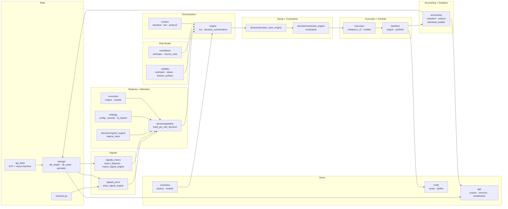

# Backend Module Map

How the Python packages under `src/` (plus the `api/` service) connect. Arrows
show the dominant data/dependency direction through one engine evaluation and on
into persistence and analytics.

## Modules

| Area | Package(s) | Responsibility |
|------|-----------|----------------|
| **Data** | `api_fetch`, `storage`, `universe` | Fetch ETF/macro data; read/write SQLite; define the tradable universe. |
| **Signals** | `signals_price`, `signals_macro` | Trend/momentum signals and macro direction/acceleration features. |
| **Regimes + allocation** | `decision/regime_engine`, `strategy`, `conviction`, `decision/pipeline` | Classify the regime and build the pre-risk base allocation (TLT tracker). |
| **Risk model** | `volatility`, `covariance` | Estimate asset volatility states and the covariance matrix. |
| **Sizing + constraints** | `decision/position_sizer_engine`, `decision/constraint_engine` | Vol-target sizing and final weight constraints. |
| **Orchestration** | `engine`, `context` | Wire the per-date pipeline; provide backtest vs. live context. |
| **Execution + portfolio** | `execution`, `backtest` | Turn target weights into trades; run the backtest loop. |
| **Accounting + analytics** | `accounting` | Valuation, metrics, and tearsheet construction. |
| **Serve** | `scenarios`, `api/`, `notify` | Scenario definitions, the FastAPI read/run service, and notifications. |
