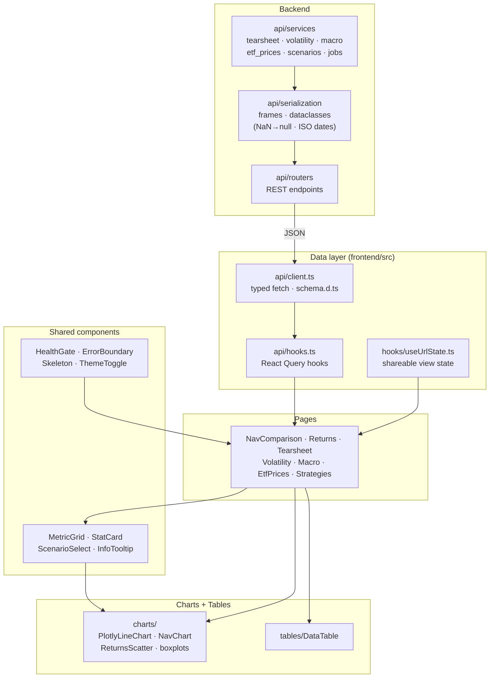

# Frontend / Data Flow

How data moves from the FastAPI service through the React data layer into pages,
components, and finally charts and tables.

## Flow

1. **Backend** — `api/services` compute results from the DB / `build_tearsheet`;
   `api/serialization` enforces the JSON boundary (NaN → null, ISO dates) before
   `api/routers` expose them as REST endpoints.
2. **Data layer** — `api/client.ts` issues typed fetches (types from
   `schema.d.ts`), wrapped by React Query hooks in `api/hooks.ts`;
   `useUrlState` keeps selected scenario/filters in the URL for shareable views.
3. **Pages** — each of the seven pages calls the relevant hook and composes
   shared components.
4. **Components** — cross-cutting UI (`HealthGate`, `ErrorBoundary`, theme,
   `MetricGrid`, `ScenarioSelect`) wraps and feeds the views.
5. **Charts + tables** — Plotly-based charts (one shared lazy chunk) and
   `DataTable` render the final visuals.
