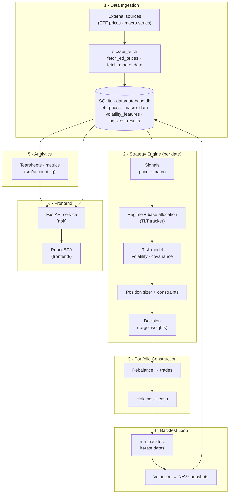

# System Overview

End-to-end flow from raw market data through the strategy engine, portfolio
construction, the backtest loop, analytics, and finally the user-facing frontend.

## Stages

1. **Data ingestion** — `src/api_fetch` pulls ETF prices and macro series from
   external providers and persists them to SQLite (`data/database.db`).
2. **Strategy engine** — for each date, price/macro signals feed a regime
   classification and TLT-tracking base allocation, which is then risk-adjusted
   (volatility + covariance), sized, and constrained into a `Decision`.
3. **Portfolio construction** — the decision's target weights drive a rebalance
   into concrete trades, updating holdings and cash.
4. **Backtest loop** — `run_backtest` walks the date range, valuing the
   portfolio into NAV snapshots and persisting results to the database.
5. **Analytics** — `src/accounting` builds tearsheets and performance metrics
   from the stored results.
6. **Frontend** — the FastAPI service exposes the data/analytics over REST; the
   React SPA renders the interactive research dashboard.
